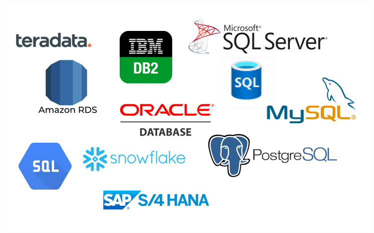

# Uygulamalı Flask-05: Flask Web Uygulamasıyla SQL'i Kullanmak

Bu uygulamalı eğitimin amacı öğrencilere Amazon Linux 2023 EC2 örneğinde formların nasıl işleneceği, veritabanına nasıl bağlanılacağı ve Flask web uygulaması içerisinde sql'nin nasıl kullanılacağı hakkında giriş bilgisi vermektir.

## Öğrenme Çıktıları

Bu uygulamalı eğitimin sonunda öğrenciler;

- Amazon Linux 2023 EC2 örneğine Python ve Flask çerçevesini yükleyin.

- Python Flask çerçevesiyle bir web uygulaması oluşturun.

- flask-wtf modülünü kullanarak formları yönetin.

- 'sqlite' veritabanına bağlantıyı yapılandırın.

- 'MySQL' veritabanına bağlantıyı yapılandırın.

- Flask uygulaması içindeki SQL'i kullanarak bir veritabanıyla çalışın.

- uygulama sürümlendirmesini yönetmek için git repo'yu kullanın.

- GitHub deposunu kod tabanı olarak kullanarak web uygulamasını AWS EC2 örneğinde çalıştırın.

## Öğrencilerin şunları yapması bekleniyor:

- `app-with-sqlite.py` dosyasını inceleyin ve çalıştırın

- Aynı klasörde `app-with-mysql.py`yi oluşturun ve aynı uygulamayı RDS MYSQL veritabanına göre yapılandırın.

## Anahat

- Bölüm 1 - Örnek Web Uygulamasını SQLite ve veritabanı uygulamasıyla çalıştırın

- Bölüm 2 - Aynı uygulamayı MySQL ile yazın

- Bölüm 3 - RDS kullanarak Amazon Linux 2023 EC2 Örneğine Python ve Flask çerçevesini yükleyin

## Bölüm 1 - Yerelinizde SQLite ve veritabanı uygulamasıyla Örnek Web Uygulamasını İnceleyin ve Çalıştırın

- Bu proje için hangi modülün içe aktarıldığını inceleyin

- "app-with-sqlite.py" dosyasının "Veritabanı" yapılandırmasının anatomisini inceleyin

''''
- Dokümantasyona göre SQLite için gerekli çevresel değişkenleri ekler
    https://flask-sqlalchemy.palletsprojects.com/en/2.x/config/

- Varsa kullanıcılar tablosunu bırakır, yeni kullanıcılar tablosu oluşturur ve örnek için bazı satırlar ekler

- Tablolara veri işlemek için sql komutlarını çalıştırır

''''

- 'app-with-sqlite.py'de belirlenen 'İşlevler'in anatomisini inceleyin

''''
- Veritabanındaki kullanıcı tablosundan anahtar kelimeyi kullanarak e-postaları bulan `find_emails` adlı işlev,
  ve sonucu `(isim, e-posta)` olarak döndürür.

- Veritabanındaki kullanıcı tablosuna yeni e-posta ekleyen 'insert_email' adlı işlev.
''''

- 'app-with-sqlite.py'de belirlenen 'Dekoratörlerin' anatomisini inceleyin

''''
- 'Emails' adlı işlev, 'GET' ve 'POST' yöntemlerini kullanarak anahtar kelimeye göre e-posta adreslerini bulur,
'şablonlar' klasörü altında verilen 'emails.html' adlı şablon dosyalarını kullanır
ve ('/')'nin statik yoluna atar

- `add_email` adlı fonksiyon, `GET` ve `POST` yöntemlerini kullanarak veritabanına yeni e-posta ekler,
`templates` klasörü altında verilen `add-email.html` adlı şablon dosyalarını kullanır ve ('add') dosyasının statik yoluna atar

- Flask uygulamasına 8080 numaralı bağlantı noktasındaki herhangi bir ana bilgisayardan erişilebilir.
''''

- 'Sudo pip3 install' aracılığıyla 'flask-mysql, sqlalchemy, Flask-SQLAlchemy'yi kurduğunuzdan emin olun.

- 'app-with-sqlite.py' uygulamasını çalıştırın

- Veritabanı tablolarını SQLite Tarayıcı aracılığıyla kontrol edin (SQLite Tarayıcısını aşağıdaki bağlantıdan indirebilirsiniz:
https://sqlitebrowser.org/)

## Bölüm 2 - Aynı uygulamayı MySQL ile yazın ve Yerel'inizde çalıştırın

- Aşağıdaki yapılandırmalara sahip bir RDS veritabanı oluşturun:

''''
- Motor seçeneği : MySQL
- Sürüm : 8.0.35
- Şablon : Ücretsiz katman
- Veritabanı bulut sunucusu sınıfı : db.t2.micro
- Herkese açık : ***Evet
- Ana kullanıcı adı: admin
- Ana şifre: Clarusway_1
-İlk DB adı: clarusway

''''
- 'app-with-sqlite.py' yakınında aynı klasörü 'app-with-mysql.py' oluşturun

- Aynı uygulamayı SQLite yerine RDS MYSQL veritabanına göre yapılandırın

- Ortam değişkeni için belgeleri kontrol edin

(https://flask-mysql.readthedocs.io/en/stable/)

- kodunuzu kaydedin ve GitHub deponuza gönderin

- Bir Örnek başlatın ve dosyalarınızı ona çekin

## Bölüm 3 - Amazon Linux 2023 EC2 Örneğine Python ve Flask çerçevesini yükleyin

- SSH (Port 22) ve HTTP (Port 8080) bağlantılarına izin veren güvenlik grubuyla Amazon Linux 2023 AMI'yi kullanarak bir Amazon EC2 bulut sunucusu başlatın.

- Örneğinize SSH ile bağlanın.

- Örneğinizde yüklü paketleri ve paket önbelleğini güncelleyin.

- 'Python 3' ve 'pip3' paketlerini yükleyin.

- Python3 ve 'pip3' versiyonunu kontrol edin

- !!!!! flask'ın son sürümünden hata alabileceğiniz için EC2 üzerinde çalışırken `Python 3 Flask (pip install Flask==2.3.3)` çerçevesini kurun.

- 'flask_mysql'i yükleyin.

- Uygulamayı Python ile çalıştır